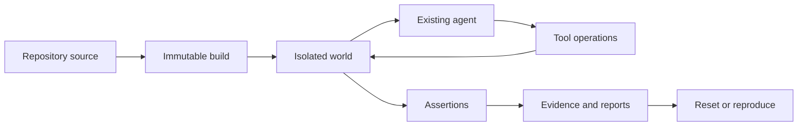

Firedrill compiles repository-owned definitions into an immutable synthetic world, gives an existing agent short-lived access to that world, and verifies the consequences of the agent's actions.

## The lifecycle

<Steps>
  <Step title="Compile repository source">
    Firedrill validates Tool declarations, behavior modules, world data, scenarios, targets, drills, and suites. Equivalent source normalizes to the same content-addressed build.
  </Step>
  <Step title="Materialize an isolated world">
    Each drill attempt starts from the pinned build and scenario in a separate SQLite-backed world. Its state, virtual clock, faults, callbacks, pending work, and ordered journal move together.
  </Step>
  <Step title="Connect the agent">
    The target receives only its declared direct, HTTP, MCP, or CLI binding. The agent process keeps its own model credentials and orchestration.
  </Step>
  <Step title="Observe consequences">
    Tool calls run deterministic behavior against the world. Firedrill records operation outcomes, state mutations, events, faults, time changes, callbacks, and optional caller-supplied captures.
  </Step>
  <Step title="Evaluate assertions">
    Assertions query the recorded world rather than trusting the agent's final message. A successful agent response does not override a failed state, call, event, callback, or ordering assertion.
  </Step>
  <Step title="Seal the result">
    Firedrill writes portable report formats and retains the exact build hash and seed. Reset restores the starting definition; reproduction reruns the same immutable build and seed.
  </Step>
</Steps>

## Local and hosted use the same model

The local framework provides the complete development loop: author, compile, serve, run, assert, inspect, report, reset, and reproduce. Firedrill Cloud adds managed sessions, durable history, collaboration, retained artifacts, and attestation without changing the meaning of a Tool, scenario, drill, or run.

<Note>
  Firedrill Cloud is currently in private preview. The public local workflow does not require a Cloud account.
</Note>

## What remains outside Firedrill

Firedrill does not own the customer agent, its prompts, model provider, production database, or production credentials. It controls the synthetic dependencies and the test evidence. This boundary lets the same world exercise agents built with different languages, frameworks, and interaction styles.
